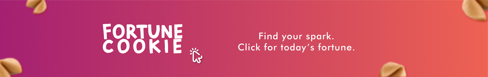

# Lucky Cookie

**Live project:** [luckycookie.app](https://luckycookie.app)

Lucky Cookie is a personal web product that started as a small interactive experiment and gradually evolved into a broader exercise in **UX/UI, product thinking, visual design, QA, and front-end implementation**.

I originally built the project as **Fortune Cookie**, a digital interpretation of the familiar fortune-cookie experience: users could reveal a positive message and a set of random numbers once per day.

Over time, I kept revisiting the idea — testing the experience, identifying friction, refining the visual system, improving responsive behavior, and learning enough front-end development to implement the changes myself.

The current project is **Lucky Cookie 2.0**.

It works and is publicly deployed, but it is still evolving.

---

## Why I built it

My background is primarily in **brand and visual design**, not software development.

Lucky Cookie became a way for me to explore what happens when design decisions move beyond static screens and need to work as an actual product.

The project allowed me to work across several areas I care about:

- UX/UI design
- interaction design
- responsive behavior
- usability and heuristic evaluation
- QA and iterative testing
- content structure
- multilingual experiences
- basic front-end development
- product thinking
- deployment and maintenance

Rather than treating code as the end goal, I use it as another tool to make ideas testable and functional.

---

## From Fortune Cookie to Lucky Cookie

The first version was created under the name **Fortune Cookie**.

The original concept focused on recreating the small ritual of opening a fortune cookie digitally:

1. The user enters the experience.
2. A fortune is revealed.
3. Random numbers accompany the message.
4. The result can be saved or shared.
5. The experience is intentionally limited to one fortune per day.

The initial prototype helped me understand the difference between designing an interface and designing an experience that actually has to behave consistently across browsers, screen sizes, languages, and user actions.

As the project developed, I revisited both the product concept and its identity.

That evolution eventually led to the rename:

**Fortune Cookie → Lucky Cookie**

The new name reflects a project that has grown beyond its original prototype while keeping the same core playful interaction.

---

## Product experience

The current experience includes:

- Daily fortune interaction
- Random number generation
- English and Spanish content
- Responsive layout
- Share functionality
- Downloadable fortune image
- Custom visual assets and typography
- Mobile and desktop behavior
- Firebase Hosting
- Custom domain

Some of these features went through several iterations as I tested different approaches and discovered practical constraints that were not visible during the initial design stage.

---

## UX and QA approach

A large part of this project has been about observing where the experience does not behave as expected and improving it iteratively.

I pay particular attention to:

- consistency between user expectations and system behavior
- interaction feedback
- visual hierarchy
- responsive layouts
- readability
- error states
- language changes
- browser behavior
- asset loading
- sharing behavior
- mobile usability

I also use usability heuristics as a reference when reviewing the experience, rather than evaluating the interface only from a visual perspective.

Testing the actual implementation has repeatedly changed design decisions — one of the most valuable lessons from the project.

---

## Learning through implementation

Lucky Cookie was also one of the projects through which I started becoming more comfortable working directly with code.

The current version uses primarily:

- HTML
- CSS
- JavaScript
- JSON
- Firebase Hosting

The repository reflects that learning process.

It is not intended as an example of advanced software architecture. Some areas still need refactoring and better organization.

For me, its value lies elsewhere: it documents the progression from a visual concept into a working digital experience that I can inspect, test, debug, deploy, and continue improving myself.

---

## Current status

**Version:** 2.0  
**Status:** Functional / paused for user testing

The current public version is live at:

**https://luckycookie.app**

Development is currently paused before the next UX research phase. The next step is to test the experience with an initial group of **5 potential users**, observing what they understand, what they enjoy, what feels confusing, and what they would change. Their feedback will be used as qualitative input for the next iteration.

The next stages include:

- user testing and feedback analysis
- iterating based on findings
- cleaning and restructuring parts of the codebase
- improving accessibility
- continuing responsive QA
- refining interaction details
- improving project documentation
- revisiting parts of the visual and UX system

The project is also being explored beyond its original personal-use concept, although that work is intentionally not documented publicly at this stage.

---

## What this project represents

Lucky Cookie is less about demonstrating that I am a developer and more about demonstrating how I approach a digital product.

I tend to move between:

**research → concept → visual design → UX → implementation → testing → iteration**

Building the project myself helped me understand where design decisions meet technical reality, and made me more conscious of edge cases, implementation constraints, user behavior, and system thinking.

It remains a work in progress — and that is also part of the point.

---

**Laura Mujica · 2026 ⚡**  
[lauramujica.com](https://lauramujica.com/)

---

# Project Archive — Original README

The content below is preserved from the original repository README as part of the project's early history and first implementation stage.

---

# fortune_cookie

**Project Title: Fortune Cookie**

**Slogan:** "Find Your Spark. Click for Today's Fortune."

**Description:**
Fortune Cookie is a web-based application designed to provide users with daily positive messages and random numbers, wrapped in the metaphorical experience of opening a fortune cookie. The user interface presents an open fortune cookie displaying a message alongside several numbers, offering a blend of inspiration and numerological insights.

**Key Features:**

* Reveal Fate Button: By clicking the "Reveal Fate" button, users can unveil a new message and a set of random numbers each day, fostering positivity and offering numerological guidance.
* User Interface: The interface showcases an interactive fortune cookie illustration that changes its displayed message and numerology with each click, resembling the experience of opening a physical fortune cookie.
* Additional Features: The site also includes a hamburger menu for navigation, the ability to take a screenshot, and social media sharing options to spread the positive message.

**Objective:**
The primary aim of Fortune Cookie is to provide users with a daily dose of positivity through inspirational messages and the option to explore random numbers for entertainment or numerological curiosity.

**Purpose:**
With a focus on delivering a positive experience, the platform aims to uplift users' spirits by providing a daily source of encouragement and a touch of fun through numerology.

**Status:**
The project is currently in the UI development phase, focusing on creating an engaging and intuitive user interface to deliver the envisioned experience effectively.

---

---
**02.20.2024**
